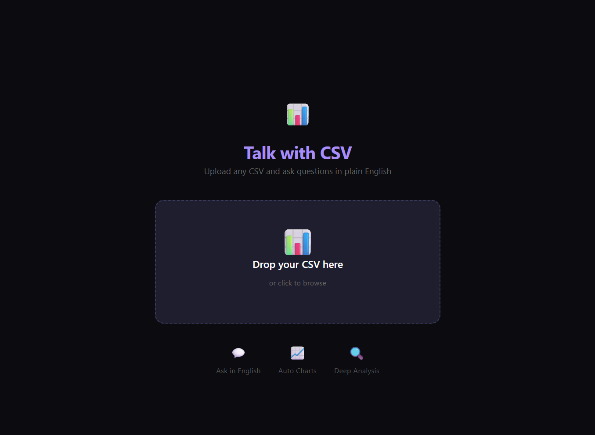
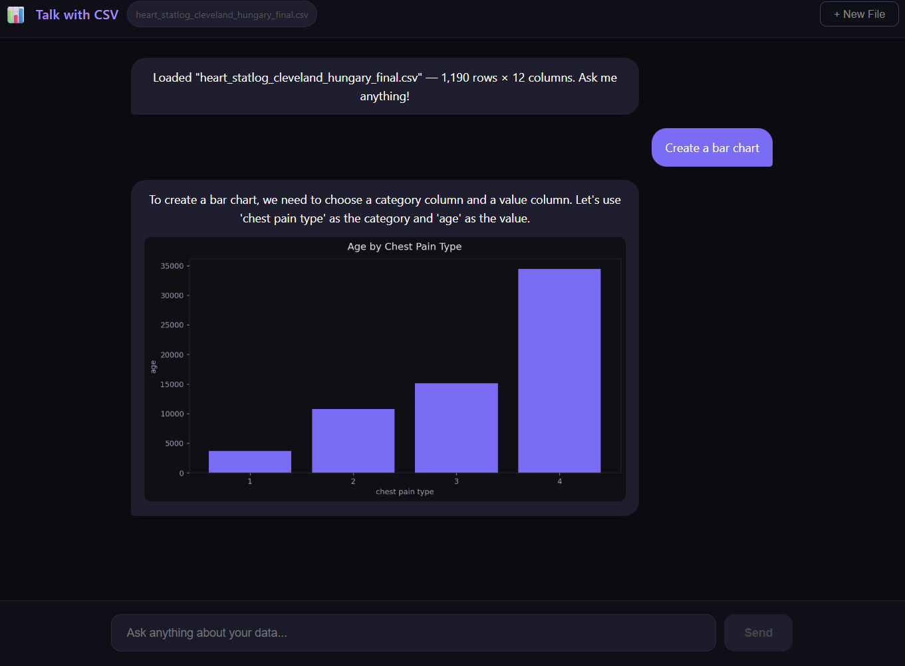

# Talk with CSV

**REACT**  
18.3.0  

**FASTAPI**  
0.115.0  

**GROQ AI**  
LLAMA-3.3-70B  

**PANDAS**  
2.2.0  

**MATPLOTLIB**  
3.8.0  

---

An AI-powered web application that lets you upload any CSV file and ask questions about your data in plain English. Get instant answers, automatic charts, and data insights — no SQL or coding required.

**Live Demo:** not deployed yet

---

## Features

- **Upload any CSV** — Drag & drop or click to browse
- **Ask in plain English** — "Show me average age by gender", "Create a bar chart of chest pain types"
- **Auto-generated charts** — Bar charts, line plots, histograms based on your question
- **Data preview** — See column names, data types, and row counts instantly
- **Chat history** — Full conversation context with your data
- **Smart suggestions** — One-click starter questions

---

## Screenshots

### Upload Interface

### Chat & Charts

---

## Tech Stack

| Layer | Technology |
|-------|------------|
| Frontend | React 18 + Vite |
| Backend | FastAPI (Python 3.11) |
| AI Model | Groq LLAMA-3.3-70B (Free) |
| Data Processing | Pandas, NumPy |
| Charts | Matplotlib |
| Styling | Custom CSS |

---

## How It Works

1. **Upload CSV** → Backend reads file with Pandas, stores schema (columns, dtypes, row count)
2. **Ask Question** → Frontend sends question + data schema to Groq AI
3. **AI Processing** → Groq returns structured response: `{ answer, chart_type, x_column, y_column }`
4. **Chart Generation** → Backend generates chart with Matplotlib, returns as base64 PNG
5. **Display** → Frontend renders answer + chart + optional data table

---

## Installation

### Prerequisites
- Python 3.11+ (with Anaconda)
- Node.js 18+
- Groq API Key (Free) → [console.groq.com](https://console.groq.com)
